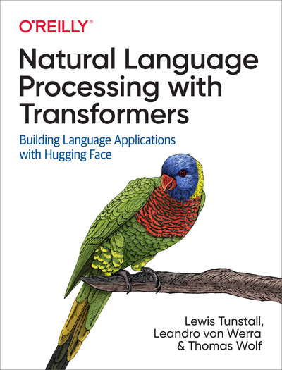

# Transformers Notebooks (2026 port)

The example code from the O'Reilly book [Natural Language Processing with Transformers](https://www.oreilly.com/library/view/natural-language-processing/9781098136789/), ported from the original pins (Python 3.9, `transformers==4.16`, `datasets==1.16`, `farm-haystack` 0.9) to a stack that installs and runs today.



The original notebooks are at [nlp-with-transformers/notebooks](https://github.com/nlp-with-transformers/notebooks). This folder keeps the same layout and the same book text. Only the code was changed where the new libraries required it. Bigger departures from the book are flagged in the notebooks with a `> **Note (updated for ...)**` cell.

> ⚠️ These notebooks were migrated by reading and updating the code against the installed library versions. They have **not** been executed end-to-end, so expect the odd runtime fix while working through them.

## Stack

| Library | Original | Now |
|:--|:--|:--|
| Python | 3.9 | 3.12 |
| PyTorch | 1.x | 2.14 (CUDA 13, supports RTX 50xx / Blackwell) |
| 🤗 Transformers | 4.16 | 5.15 (pinned, see below) |
| 🤗 Datasets | 1.16 | 5.0 (+ 🤗 Evaluate for metrics) |
| 🤗 Accelerate | 0.5 | 1.15 |
| Haystack (ch. 7) | farm-haystack 0.9 + Elasticsearch | haystack-ai 3.3 (in-memory document store, no server) |
| ONNX (ch. 8) | `transformers.convert_graph_to_onnx` | `torch.onnx.export` + ONNX Runtime 1.30 |
| pandas / NumPy | 1.x / 1.x | 3.0 / 2.5 |

> **Why Transformers 5.15 and not the latest?** Tokenizers ≥ 0.23.1 has a bug ([huggingface/tokenizers#2091](https://github.com/huggingface/tokenizers/issues/2091)) that drops most of the windows produced by `return_overflowing_tokens=True`, which silently breaks the question-answering sliding window in Chapter 7. Transformers ≥ 5.16 requires that tokenizers version, so `requirements.txt` pins `transformers<5.16` and `tokenizers<0.23.1`. Lift both pins once the bug is fixed upstream.

## Getting started (local)

The environment is already created in `.venv` and registered in Jupyter as the **"Python (nlpt)"** kernel. To recreate it from scratch:

```bash
cd notebooks/nlpt/notebooks
uv venv --seed --python 3.12 .venv   # --seed includes pip
uv pip install --python .venv/bin/python -r requirements.txt
.venv/bin/python -m ipykernel install --user --name nlpt --display-name "Python (nlpt)"
```

Or with conda: `conda env create -f environment.yml && conda activate nlpt`.

Then start Jupyter (`jupyter lab`) and pick the **Python (nlpt)** kernel.

Chapter 11's audio example decodes audio with `torchcodec`, which needs the FFmpeg libraries (`sudo apt install ffmpeg`, or use the conda environment, which installs them).

### GPU memory

Most chapters need a GPU, and an 8 GB card is tight. Other programs that keep models in VRAM (for example a local Ollama server) leave too little memory and cause `CUDA out of memory` errors. `setup_chapter()` warns you when less than 3 GB of VRAM is free. Free it with `ollama ps` / `ollama stop <model>`, then restart the kernel. You can always check with `nvidia-smi`.

### Hugging Face Hub

Training cells use `push_to_hub=False` by default, so you don't need a Hub account. To push your own models, run `notebook_login()` (from `huggingface_hub`) and set `push_to_hub=True`. Where the book loads its own fine-tuned models afterwards, the notebooks use the `transformersbook/*` checkpoints, which are still on the Hub.

## Running on Colab / Kaggle

Open a chapter notebook and uncomment its first cell. It clones this repo (the notebooks need `utils.py`, `images/` and `data/` next to them) and installs the requirements:

```python
!git clone https://github.com/juancgar/nlp-with-transformers-2026.git
%cd nlp-with-transformers-2026
from install import *
install_requirements()
```

On Kaggle, turn on **Internet** and a **GPU** accelerator in the notebook settings first, and restart the session after installing if it asks you to.

`side_minGPT.ipynb` is self-contained: you can upload just that file and run it with nothing to install.

## What changed (all chapters)

- **TensorFlow / Flax were removed in Transformers v5.** The optional TF code paths from the book were replaced with a short note; the PyTorch path is unchanged.
- **Removed pipelines.** `question-answering`, `summarization`, `translation` and `text2text-generation` no longer exist. The notebooks do the same steps explicitly (tokenizer → model → decode / `generate`).
- **Changed pipeline defaults.** `pipeline("text-generation")` now defaults to a 3B model, so the notebooks pass the book's model explicitly. Pipelines now place models on the GPU automatically.
- **Trainer API.** `evaluation_strategy` → `eval_strategy`, `Trainer(tokenizer=...)` → `processing_class=...`, `compute_loss(..., num_items_in_batch=None)`, `tokenizer.as_target_tokenizer()` → `tokenizer(text_target=...)`.
- **Datasets.** Loading scripts are no longer supported, so the notebooks use the Hub's parquet versions: `dair-ai/emotion`, `google/xtreme`, `abisee/cnn_dailymail`, `knkarthick/samsum` (the original SAMSum was taken down), `megagonlabs/subjqa` (parquet branch), `clinc/clinc_oos`.
- **Metrics.** `datasets.load_metric` → `evaluate.load`.
- **Hub.** `huggingface_hub.Repository` (git-based) → `create_repo` / `upload_folder`.
- **pandas 3, NumPy 2, scikit-learn 1.9 and matplotlib 3.11 updates** where the old calls were removed.

## Chapters

| Chapter | Notebook | Main changes |
|:--|:--|:--|
| Introduction | `01_introduction.ipynb` | Removed QA / summarization / translation pipelines are done by hand, and text generation is pinned to `gpt2`. |
| Text Classification | `02_classification.ipynb` | `huggingface_hub.list_datasets`; TF cells replaced by notes; `Trainer(processing_class=...)`; `top_k=None` instead of `return_all_scores`. The v5 DistilBERT tokenizer also returns `token_type_ids` (ignored by the model). |
| Transformer Anatomy | `03_transformer-anatomy.ipynb` | Install cell only. bertviz and the from-scratch encoder work unchanged. |
| Multilingual NER | `04_multilingual-ner.ipynb` | `google/xtreme`; the custom `XLMRobertaForTokenClassification` calls `post_init()` (`init_weights()` alone fails in v5); `DataFrame.append` → `pd.concat`. |
| Text Generation | `05_text-generation.ipynb` | Install cell plus a memory tip (GPT-2 XL in fp32 is ~6.5 GB; use `dtype=torch.float16` if needed). |
| Summarization | `06_summarization.ipynb` | `summarization_pipeline()` helper replaces the removed pipeline; `evaluate` metrics (ROUGE returns floats); `knkarthick/samsum`; `text_target=`; `punkt_tab`. |
| Question Answering | `07_question-answering.ipynb` | Rewritten for Haystack 3: in-memory BM25 store (no Elasticsearch), `TransformersExtractiveReader`, DPR through sentence-transformers. Reader fine-tuning uses the 🤗 `Trainer`, and RAG uses `RagTokenForGeneration`. Replaces both old chapter 7 notebooks. |
| Efficient Transformers in Production | `08_model-compression.ipynb` | `clinc/clinc_oos`; distillation trainer updated (`num_items_in_batch`); `torch.ao.quantization`; ONNX export with `torch.onnx.export(dynamo=True)` and an ORT quantization fix; pipelines kept on CPU for fair latency. Also fixes the book's `alpha=1` int bug in the Optuna search. |
| Few to No Labels | `09_few-to-no-labels.ipynb` | Uses the local issues file; nlpaug via `use_custom_api=False` (its BERT wrapper is broken on v5); `trainer.save_model()` before reloading. |
| Training from Scratch | `10_transformers-from-scratch.ipynb` | `bytes_to_unicode` moved; `Repository` → `create_repo` / `upload_folder`; the training script imports what it uses; `max_new_tokens` for the v5 generation defaults. |
| Future Directions | `11_future-directions.ipynb` | `superb` → `hf-internal-testing/librispeech_asr_dummy` (audio decoded by torchcodec). TAPAS no longer needs torch-scatter. |

### Side notebooks

| Topic | Notebook | What it covers |
|:--|:--|:--|
| minGPT | `side_minGPT.ipynb` | A walk-through of [karpathy/minGPT](https://github.com/karpathy/minGPT): attention, blocks, generation and training explained piece by piece. Three experiments: sorting numbers, character-level Shakespeare, and loading real GPT-2 weights into the hand-written model, which gives the same logits as 🤗 Transformers. Best read after chapter 3. |

### Known limits on an 8 GB GPU

The book's hyperparameters are unchanged, and the notebooks add comments where they're too big. As written, the PEGASUS evaluation (`batch_size=8`) and fine-tuning in Chapter 6, the MLM domain adaptation in Chapter 9, and the Chapter 10 training script (meant for multi-GPU `accelerate launch`) are likely to run out of memory.

## Citation

```
@book{tunstall2022natural,
  title={Natural Language Processing with Transformers: Building Language Applications with Hugging Face},
  author={Tunstall, Lewis and von Werra, Leandro and Wolf, Thomas},
  isbn={1098103246},
  url={https://books.google.ch/books?id=7hhyzgEACAAJ},
  year={2022},
  publisher={O'Reilly Media, Incorporated}
}
```
